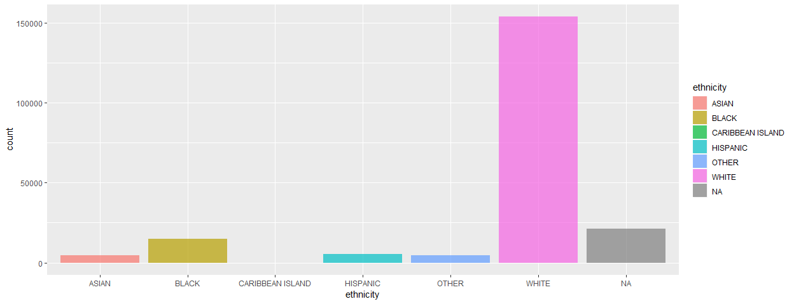

MIMIC plot 2
================
Sukhpal Rapal
7/23/2018

## MIMIC data plot

``` r
load("data.rdat")
data = mimic_thrombocytopenia2_df
```

# cleaning the data for Plotting

``` r
data$ethnicity[which(data$ethnicity == "UNKNOWN/NOT SPECIFIED")] = NA
data$ethnicity[which(data$ethnicity == "UNABLE TO OBTAIN")] = NA
data$ethnicity[which(data$ethnicity == "PATIENT DECLINED TO ANSWER")] = NA
data$ethnicity[data$ethnicity %like% "%ASIAN%"] = "ASIAN"
data$ethnicity[data$ethnicity %like% "%MIDDLE EASTERN%"] = "ASIAN"
data$ethnicity[data$ethnicity %like% "%AMERICAN INDIAN%"] = "ASIAN"
data$ethnicity[data$ethnicity %like% "%NATIVE HAWAIIAN%"] = "ASIAN"
data$ethnicity[data$ethnicity %like% "%WHITE%"] = "WHITE"
data$ethnicity[data$ethnicity %like% "%BLACK%"] = "BLACK"
data$ethnicity[data$ethnicity %like% "%HISPANIC%"] = "HISPANIC"
data$ethnicity[data$ethnicity %like% "%PORTUGUESE%"] = "HISPANIC"
data$et.1hnicity[data$ethnicity %like% "%CARIBBEAN ISLAND%"] = "HISPANIC"
data$ethnicity[data$ethnicity %like% "%SOUTH AMERICAN%"] = "HISPANIC"
data$ethnicity[data$ethnicity %like% "%MULTI RACE ETHNICITY%"] = "OTHER"
```

## Plotting

You can also embed plots, for example:

``` r
ggplot(data.frame(data), aes(x = ethnicity, fill = ethnicity)) + 
  geom_bar(alpha = 0.7)
```


